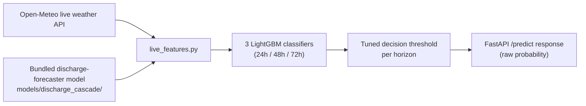
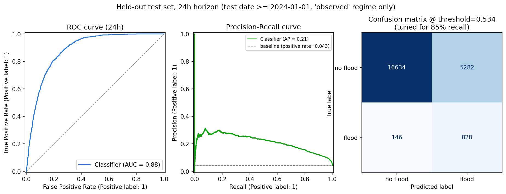
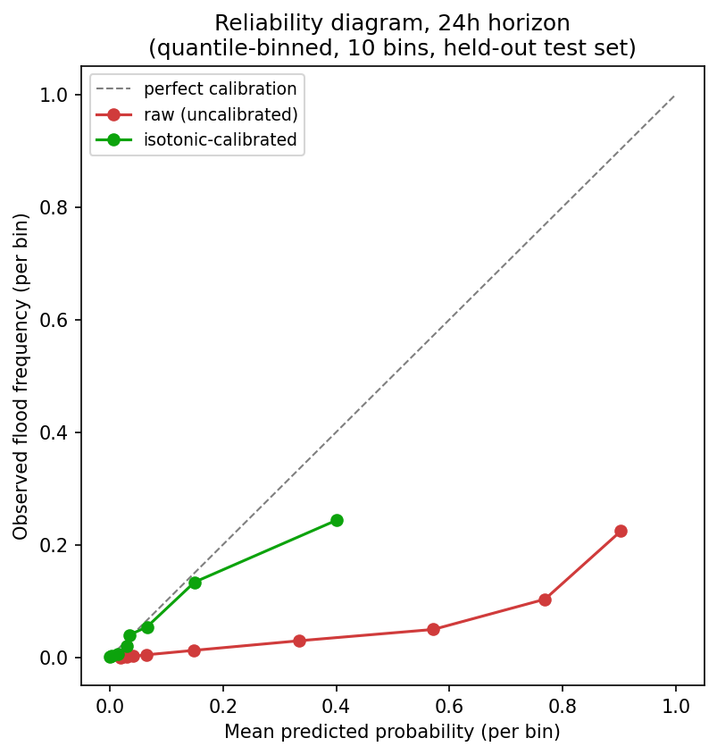
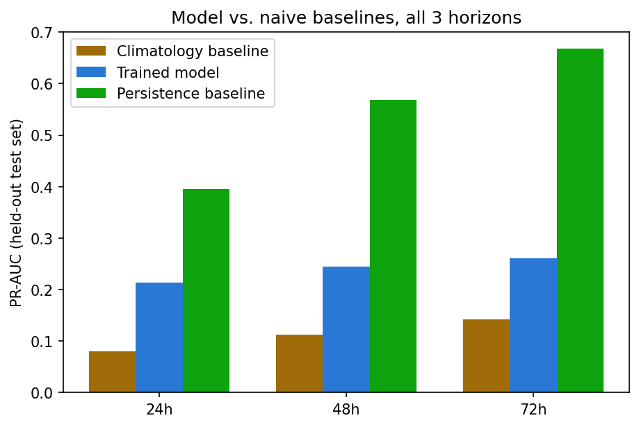
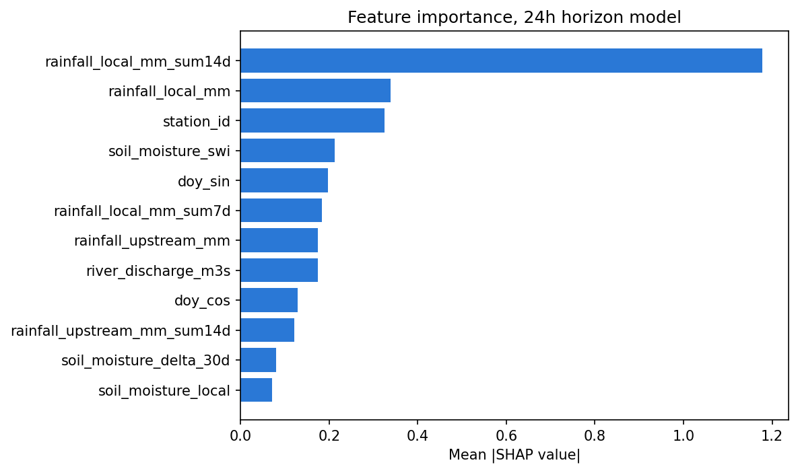
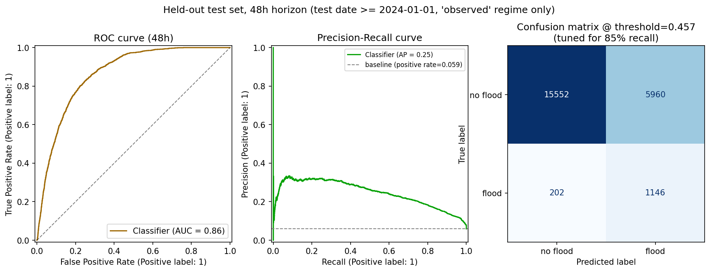
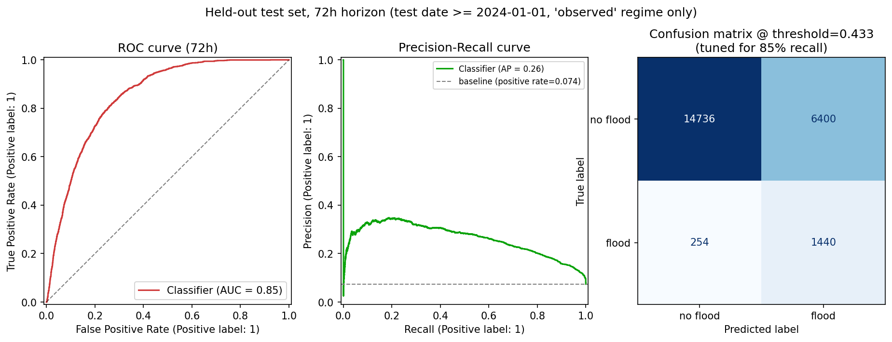
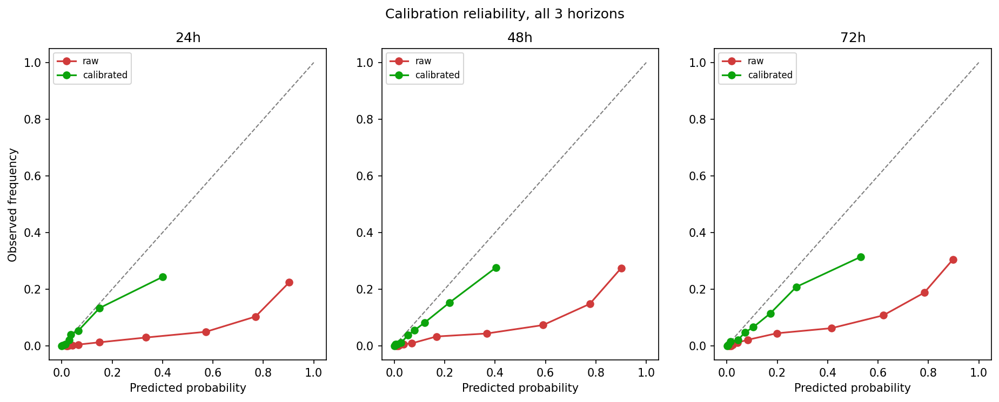
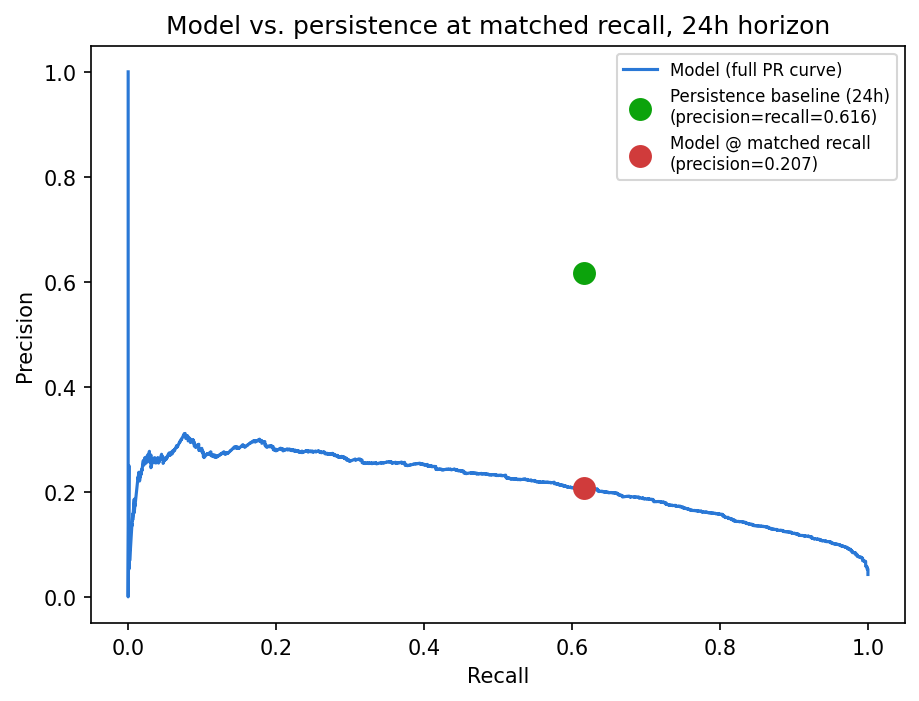

# Flood Risk Classifier

Predicts flood risk (low / moderate / high) for the next 24, 48, and 72 hours at any of 30 river
monitoring stations across Bangladesh, using live rainfall, soil moisture, and river discharge data.

This folder is **fully self-contained** — copy the whole folder to any computer with Python installed
and it will work, with no other dependencies beyond what's listed here.

---

## How it works



---

## What's in this folder

| File | What it does |
|---|---|
| `main.py` | The web server (FastAPI) — this is what you actually run |
| `flood_model.py` | Loads the trained model and turns a prediction into a risk level |
| `live_features.py` | Fetches today's real rainfall/soil moisture/river data and builds the model's input |
| `open_meteo.py` | Low-level client for the free weather/river-flow data source |
| `stations.py` | The list of 30 monitored stations and their coordinates |
| `feature_transforms.py` | The exact math that turns raw data into what the model expects |
| `schemas.py` | Defines the shape of the API's request/response data |
| `models/` | The actual trained model files (do not edit or move these) |
| `requirements.txt` | The list of Python packages this needs |

---

## Part 1 — Running it on your own computer

### Step 1: Check you have Python

Open a terminal (Command Prompt, PowerShell, or a Mac/Linux terminal) and type:

```
python --version
```

You need Python 3.10 or newer. If that command isn't found, try `python3 --version` instead. If neither
works, install Python from [python.org](https://python.org) first (check the box that says "Add Python
to PATH" during installation on Windows).

### Step 2: Open a terminal inside this folder

Navigate to wherever you copied this `flood-risk-classifier` folder, e.g.:

```
cd path/to/flood-risk-classifier
```

### Step 3: Create a virtual environment (keeps this project's packages separate from everything else on your computer)

```
python -m venv .venv
```

This creates a `.venv` folder inside `flood-risk-classifier`. You only need to do this once.

### Step 4: Activate the virtual environment

**On Windows (Command Prompt):**
```
.venv\Scripts\activate.bat
```

**On Windows (PowerShell):**
```
.venv\Scripts\Activate.ps1
```

**On Mac/Linux:**
```
source .venv/bin/activate
```

You'll know it worked because your terminal prompt will now start with `(.venv)`. You need to do this
every time you open a new terminal to work on this project — not just once.

### Step 5: Install the required packages

```
pip install -r requirements.txt
```

This downloads everything the project needs (takes a minute or two, needs an internet connection).

### Step 6: Run the server

```
uvicorn main:app --reload --port 8000
```

You should see output ending with something like `Uvicorn running on http://127.0.0.1:8000`. Leave this
terminal window open — the server keeps running as long as this command is active. Press `Ctrl+C` to
stop it.

### Step 7: Check it's actually working

Open a **new** terminal window (leave the server running in the first one) and either:

- Open your web browser and go to **http://127.0.0.1:8000/docs** — this gives you an interactive page
  where you can try the API directly, no coding needed.
- Or run this command:
  ```
  curl "http://127.0.0.1:8000/predict?station_id=SW90"
  ```

If you get back a block of JSON text with a `risk_level` field, it's working.

---

## How this model was trained, and how it performs

Three independent LightGBM classifiers (one per horizon: 24h/48h/72h), trained on ~5 years of daily
rainfall, soil moisture, and river-discharge features for all 30 stations. Decision thresholds were
deliberately tuned to prioritize **recall** (catching real floods) over precision (few false alarms),
since a missed flood is worse than an extra warning.

An isotonic calibrator was trained per horizon (fixing the raw model's severe overconfidence — see the
reliability diagrams below) and is saved in `models/` as `model_<horizon>h_calibrator.joblib`, but it is
**not currently wired into the live `/predict` response** — the API returns the raw, uncalibrated
probability. This is a known, disclosed gap, not an oversight: the decision threshold (which drives
`risk_level`) was tuned on raw scores and doesn't need calibration to work correctly; only the numeric
`probability` field would look better calibrated if this were wired in. Loading the calibrator and
applying it to `probability` before returning the response is a small, well-scoped follow-up (see
`flood_model.py`).

| Horizon | ROC-AUC | PR-AUC | Recall @ chosen threshold | Precision @ chosen threshold |
|---|---|---|---|---|
| 24h | 0.884 | 0.218 | 85.0% | 13.8% |
| 48h | 0.866 | 0.248 | 85.0% | 16.1% |
| 72h | 0.847 | 0.265 | 85.0% | 18.2% |

**Honesty check against naive baselines** (a real, deliberately reported finding, not hidden): the
model clearly beats a climatology baseline at every horizon, but does **not** beat a simple
"tomorrow = today" persistence baseline on PR-AUC. Working explanation: flood labels cluster in
multi-day contiguous blocks, so persistence is unusually strong at predicting the *continuation* of an
already-ongoing flood — the easiest part of this problem. The model's real value is plausibly
concentrated in predicting flood *onset*, which persistence can never do.

<p align="center">
  <br>
  <sub><i>ROC curve, Precision-Recall curve, and confusion matrix — 24h horizon, held-out test set
  (date &ge; 2024-01-01).</i></sub>
</p>

<p align="center">
  <br>
  <sub><i>Reliability diagram, 24h horizon. The raw model is severely overconfident — a stated 90%
  probability corresponds to an observed flood frequency of only ~23%. Calibration closes most, not
  all, of that gap.</i></sub>
</p>

<p align="center">
  <br>
  <sub><i>Model PR-AUC vs. climatology and persistence baselines, all 3 horizons — the honesty check
  described above.</i></sub>
</p>

<p align="center">
  <br>
  <sub><i>SHAP feature importance, 24h horizon model — 14-day cumulative local rainfall dominates.</i></sub>
</p>

<p align="center">
  <br>
  <sub><i>ROC curve, Precision-Recall curve, and confusion matrix — 48h horizon, held-out test set.</i></sub>
</p>

<p align="center">
  <br>
  <sub><i>ROC curve, Precision-Recall curve, and confusion matrix — 72h horizon, held-out test set.</i></sub>
</p>

<p align="center">
  <br>
  <sub><i>Reliability diagrams, all 3 horizons — raw vs. calibrated. Three proper scoring rules (Brier,
  log loss, ECE) all agree calibration is a real, substantial improvement at every horizon, not an
  artifact of any one metric.</i></sub>
</p>

<p align="center">
  <br>
  <sub><i>Model's full precision-recall curve vs. persistence at a matched recall point, 24h horizon —
  confirms the model-vs-persistence gap isn't an artifact of comparing mismatched operating points: even
  at persistence's own natural 61.6% recall, the model's precision (20.7%) stays far below
  persistence's (61.6%).</i></sub>
</p>

*(The single-horizon 48h/72h reliability diagrams are also in `assets/` — omitted above since
`fig_calibration_all_horizons.png` already shows all three side by side.)*

---

## Part 2 — Understanding the API

### `GET /health`
Quick check that the server and model are running. Returns `{"status": "ok", "model_loaded": true}`.

### `GET /stations`
Lists all 30 monitored stations with their ID, name, river, and coordinates. Use this to build a
dropdown/picker in your website, or to find a station ID near your users.

### `GET /predict`
The main endpoint. Call it with **either**:
- `station_id` — e.g. `/predict?station_id=SW90` (see `/stations` for the full list), **or**
- `lat` and `lon` — e.g. `/predict?lat=25.19&lon=89.66` (automatically finds the nearest of the 30
  stations; only works for coordinates inside Bangladesh)

**Example response:**
```json
{
  "station_id": "SW90",
  "station_name": "Bahadurabad",
  "station_distance_km": 0.0,
  "basin": "brahmaputra",
  "horizons": [
    {"horizon": "24h", "risk_level": "high", "probability": 0.79, "threshold": 0.53},
    {"horizon": "48h", "risk_level": "high", "probability": 0.64, "threshold": 0.46},
    {"horizon": "72h", "risk_level": "high", "probability": 0.64, "threshold": 0.43}
  ],
  "risk_level": "high",
  "risk_score": 0.79,
  "generated_at": "2026-08-10T12:00:00Z",
  "reasoning": ["Nearest gauge: Bahadurabad (Brahmaputra/Jamuna basin)...", "..."],
  "features_used": { "...": "..." },
  "data_sources": { "...": "..." }
}
```

- `horizons` — the risk at each of the 3 time windows (24/48/72 hours ahead).
- `risk_level` / `risk_score` at the top level just repeats the 24h value, for callers that only want
  one headline number.
- `reasoning` — plain-language bullet points explaining what drove the prediction (useful to display
  directly to a user).
- **Important honesty note**: at the risk threshold this model uses, roughly 14–18% of "high risk"
  alerts are followed by an actual flood (the rest are false alarms) — the model was deliberately tuned
  to catch as many real floods as possible (85% of them) even at the cost of more false alarms, since a
  missed flood is worse than an extra warning. Don't present `risk_level: "high"` to end users as a
  certainty.

### Errors you might see
| Status | Meaning |
|---|---|
| `400` | Missing both `station_id` and `lat`/`lon`, or coordinates outside Bangladesh |
| `404` | Unknown `station_id` |
| `502` | The live weather data source was unreachable — try again shortly |
| `503` | The model failed to load on server startup — check the terminal running `uvicorn` for errors |

---

## Part 3 — Calling it from a website

### Plain JavaScript (works in any website, no framework needed)

```html
<script>
async function getFloodRisk(stationId) {
  const response = await fetch(`http://127.0.0.1:8000/predict?station_id=${stationId}`);
  if (!response.ok) {
    const err = await response.json();
    throw new Error(err.detail);
  }
  return await response.json();
}

getFloodRisk('SW90').then(data => {
  console.log(data.risk_level, data.horizons);
  document.getElementById('risk-display').textContent =
    `Risk: ${data.risk_level.toUpperCase()} (24h), station: ${data.station_name}`;
});
</script>
```

### React example

```jsx
import { useEffect, useState } from 'react';

function FloodRisk({ stationId }) {
  const [data, setData] = useState(null);
  const [error, setError] = useState(null);

  useEffect(() => {
    fetch(`http://127.0.0.1:8000/predict?station_id=${stationId}`)
      .then(res => res.ok ? res.json() : res.json().then(e => Promise.reject(e.detail)))
      .then(setData)
      .catch(setError);
  }, [stationId]);

  if (error) return <p>Error: {error}</p>;
  if (!data) return <p>Loading...</p>;
  return (
    <div>
      <h3>{data.station_name} — {data.risk_level.toUpperCase()}</h3>
      {data.horizons.map(h => (
        <p key={h.horizon}>{h.horizon}: {h.risk_level} ({(h.probability * 100).toFixed(0)}%)</p>
      ))}
    </div>
  );
}
```

### About CORS (why this works from a browser at all)

Browsers block a website from calling a different server unless that server explicitly allows it. This
server is already configured to allow requests from **any** website (`allow_origins=["*"]` in
`main.py`). That's fine for local development and testing. **Before putting this on the public
internet**, open `main.py`, find the `CORSMiddleware` section, and change `["*"]` to your actual
website's address, e.g. `["https://your-website.com"]`, so random other websites can't use your server.

---

## Part 4 — Running it somewhere other than your own computer (deployment)

The steps above (Parts 1–3) work identically on a cloud server (e.g. a VPS, Render, Railway, a
university lab server) — just repeat Steps 1–6 there instead of your laptop. Two things to change for a
real deployment:

1. **Don't use `--reload`** in production — it's a development convenience that restarts the server on
   every file change, which you don't want running live. Use plain `uvicorn main:app --host 0.0.0.0
   --port 8000` instead.
2. **Lock down CORS** (see above) to your actual website's domain instead of `"*"`.
3. Your website's JavaScript `fetch()` calls need to point at wherever the server actually ends up
   running (e.g. `https://your-server-address.com/predict?...`) instead of `127.0.0.1`.

---

## Troubleshooting

- **`ModuleNotFoundError`** — you forgot to activate the virtual environment (Step 4) before running
  `uvicorn`, or forgot to run `pip install -r requirements.txt` (Step 5).
- **`No model artifacts at .../models`** — the `models/` folder is missing or was moved. Make sure you
  copied the *entire* `flood-risk-classifier` folder, including `models/`, not just the `.py` files.
- **Predictions seem to take a few seconds** — this is normal. Every prediction fetches fresh live
  weather/river data from a free public API before predicting; there's no way to make this instant
  without caching, which this simple version doesn't do.
- **`502` errors** — the free weather API this depends on (Open-Meteo) is temporarily unreachable. Wait
  a minute and try again.
